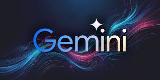
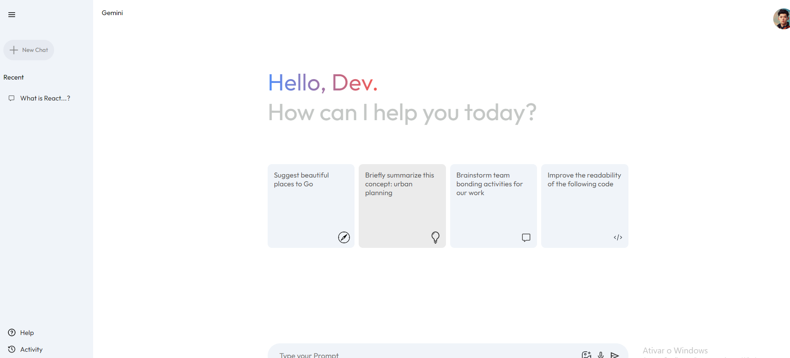

GEMINI AI Clone

📖 Descrição

Este projeto é um clone do <strong>GEMINI AI</strong>, desenvolvido para replicar funcionalidades avançadas de inteligência artificial, como processamento de linguagem natural e aprendizado de máquina. O objetivo é fornecer uma base sólida para experimentação e implementação de IA em projetos reais.

🚀 Funcionalidades
<ul>
  <li><strong>Processamento de Linguagem Natural:</strong> Algoritmos capazes de entender e responder a consultas complexas em linguagem natural.</li>
  <li><strong>Aprendizado de Máquina:</strong> Modelos que podem ser treinados para melhorar a precisão ao longo do tempo.</li>
  <li><strong>Interface Simples:</strong> Um design intuitivo e de fácil navegação para todos os usuários.</li>
</ul>
🖼️ Screenshots
<h3>Tela Inicial</h3>

<h3>Resultados de Consultas</h3>

🧰 Tecnologias Utilizadas
<ul>
  <li><strong>Frontend:</strong> React.js, HTML5, CSS3</li>
  <li><strong>Backend:</strong> Node.js, Express</li>
  <li><strong>Banco de Dados:</strong> MongoDB</li>
  <li><strong>Inteligência Artificial:</strong> Python, TensorFlow</li>
</ul>
🤝 Contribuindo

Contribuições são bem-vindas! Se você deseja contribuir com este projeto, siga os passos abaixo:

<ol>
  <li>Faça um fork do repositório.</li>
  <li>Crie uma nova branch:</li>
  <pre><code>git checkout -b feature/nova-funcionalidade</code></pre>
  <li>Faça commit das suas mudanças:</li>
  <pre><code>git commit -m 'Adiciona nova funcionalidade'</code></pre>
  <li>Envie suas mudanças para o repositório remoto:</li>
  <pre><code>git push origin feature/nova-funcionalidade</code></pre>
  <li>Abra um Pull Request.</li>
</ol>